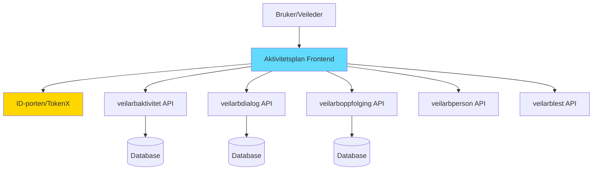
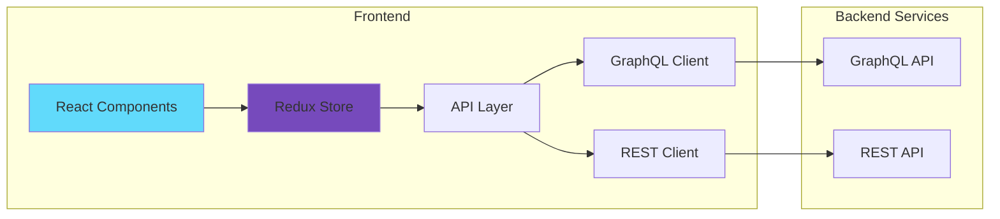
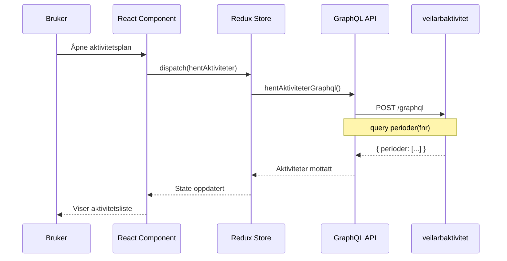
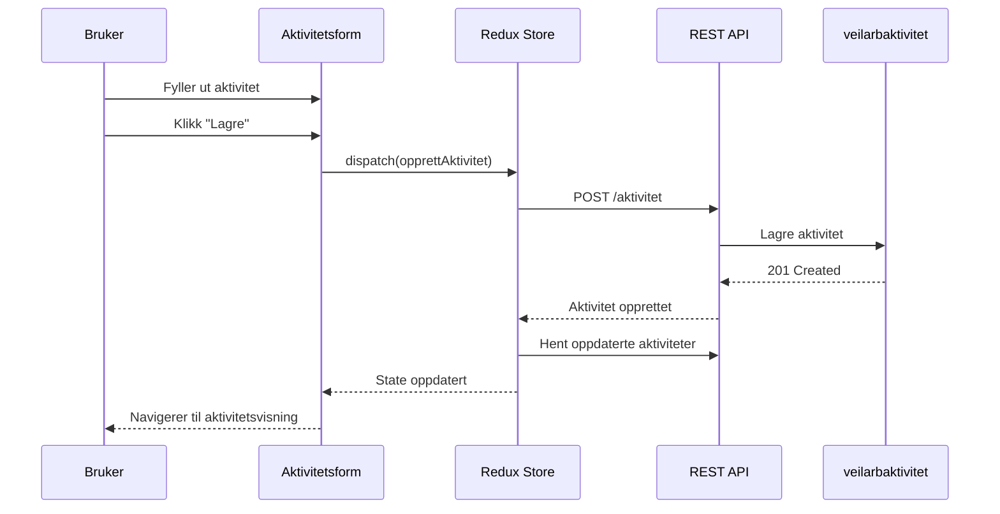
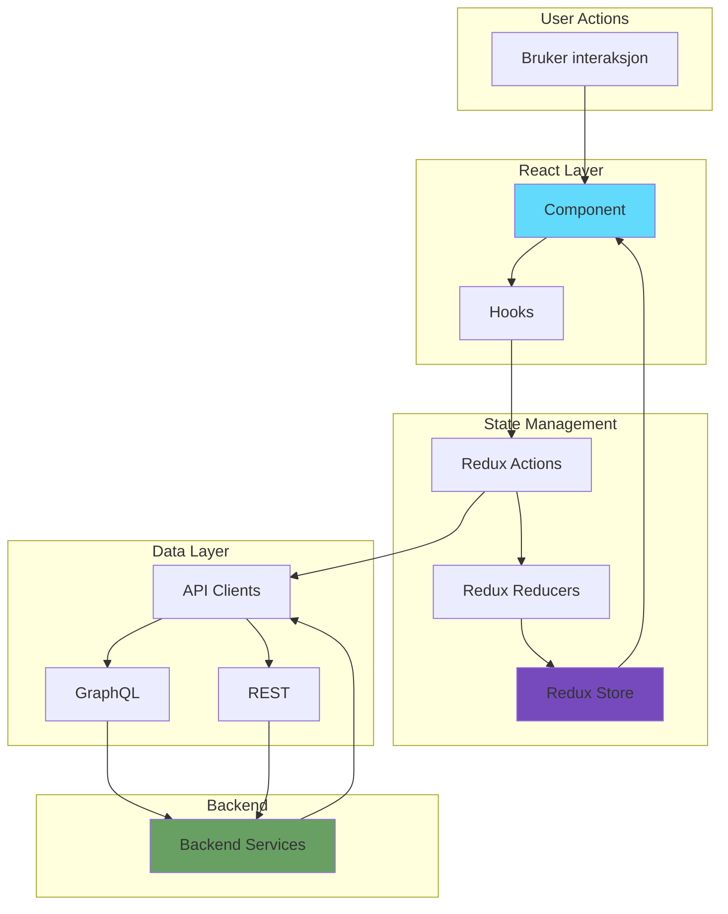

# Aktivitetsplan

[](https://github.com/navikt/aktivitetsplan/actions)
[](LICENSE.md)
[](https://www.typescriptlang.org/)
[](https://reactjs.org/)

Aktivitetsplan er et verktøy for veiledere og brukere av NAV som synliggjør hvilke aktiviteter og tiltak som skal gjennomføres for at en bruker skal oppnå sine mål. Brukere kan opprette aktiviteter som å delta på kurs, søke på en bestemt jobb eller motta behandling.

---

## Innholdsfortegnelse
- [Installasjon](#installasjon)
- [Bruk](#bruk)
- [Arkitektur](#arkitektur)
- [Nøkkelflyter](#nøkkelflyter)
  - [Hente aktiviteter](#hente-aktiviteter)
  - [Opprette ny aktivitet](#opprette-ny-aktivitet)
  - [Dataflyt](#dataflyt)
- [API-dokumentasjon](#api-dokumentasjon)
- [Teknologier](#teknologier)
- [Bidra](#bidra)
- [Lisens](#lisens)

---

## Installasjon

### Forutsetninger

- Node.js 18+ og npm
- Tilgang til NAVs GitHub Package Registry

### Oppsett

For å laste ned pakker fra NAVs package registry må du ha en `.npmrc`-fil i prosjektet eller globalt i hjemmemappen. Filen må inneholde:

```sh
//npm.pkg.github.com/:_authToken=DITT_GITHUB_ACCESS_TOKEN
```

### Installere avhengigheter

```sh
npm install
```

### Kjøre lokalt

```sh
npm run dev
```

Applikasjonen vil være tilgjengelig på `http://localhost:3000`

### Bygge for produksjon

```sh
# Bygg for dev-ekstern
npm run build:dev-ekstern

# Bygg for prod-ekstern
npm run build:prod-ekstern

# Bygg for dev-intern
npm run build:dev-intern

# Bygg for prod-intern
npm run build:prod-intern
```

### Kjøre tester

```sh
# Kjør tester i watch mode
npm test

# Generer coverage rapport
npm run coverage

# Lint kode
npm run lint

# Type-sjekk
npm run typecheck
```

---

## Bruk

### Grunnleggende oppsett

```tsx
import { Provider } from './src/Provider';
import App from './src/app';
import { createRouterWithWrapper } from './src/routing/routerConfig';

// For brukere (ekstern flate)
<Provider fnr={brukerFnr}>
  <App createRoutesForUser={createRouterWithWrapper()} />
</Provider>

// For veiledere (intern flate)
<Provider fnr={brukerFnr} aktivEnhet={veilederEnhet}>
  <App createRoutesForUser={createRouterWithWrapper()} />
</Provider>
```

### Viktige komponenter

- **Provider**: Root wrapper som setter opp Redux store og context
- **App**: Hovedapplikasjon med routing
- **Hovedside**: Hovedvisning med aktivitetstavle
- **Aktivitetvisning**: Detaljer for en enkelt aktivitet

---

## Arkitektur

### Systemarkitektur



### Applikasjonsarkitektur



### Mappestruktur

```
src/
├── api/              # API-klienter (GraphQL & REST)
├── moduler/          # Feature-baserte moduler
│   ├── aktivitet/    # Aktivitetshåndtering
│   ├── dialog/       # Dialog/meldinger
│   ├── filtrering/   # Filtrering og søk
│   └── ...
├── routing/          # React Router konfigurasjon
├── felles-komponenter/ # Delte komponenter
├── utils/            # Hjelpefunksjoner
├── datatypes/        # TypeScript types
└── store.ts          # Redux store setup
```

---

## Nøkkelflyter

### Hente aktiviteter



### Opprette ny aktivitet



### Dataflyt



---

## API-dokumentasjon

Prosjektet bruker GraphQL og REST API-er. Se `src/api/` og `graphql/schema.graphql` for detaljer.

### GraphQL Sentrale Spørringer

#### Hente perioder og aktiviteter

```graphql
query($fnr: String!) {
  perioder(fnr: $fnr) {
    id
    aktiviteter {
      id
      funksjonellId
      versjon
      tittel
      beskrivelse
      lenke
      type
      status
      fraDato
      tilDato
      opprettetDato
      endretDato
      avtalt
      # Se schema for fullstendig liste
    }
  }
}
```

#### Hente én aktivitet

```graphql
query($aktivitetId: String!) {
  eier(aktivitetId: $aktivitetId) {
    fnr
  }
  aktivitet(aktivitetId: $aktivitetId) {
    id
    tittel
    beskrivelse
    status
    type
    historikk {
      endringer {
        endretAvType
        endretAv
        tidspunkt
        beskrivelseForVeileder
        beskrivelseForBruker
      }
    }
  }
}
```

### REST Endepunkter

Se `src/api/` for alle tilgjengelige REST API-klienter:

- **aktivitetAPI.ts**: CRUD operasjoner for aktiviteter
- **dialogAPI.ts**: Håndtering av dialoger/meldinger
- **oppfolgingAPI.ts**: Oppfølgingsinformasjon
- **personAPI.ts**: Personinformasjon

### Aktivitetstyper

```typescript
enum AktivitetTypeDTO {
  EGEN              // Egenaktivitet
  STILLING          // Stillingsaktivitet
  SOKEAVTALE        // Søkeavtale
  IJOBB             // I jobb-aktivitet
  BEHANDLING        // Behandlingsaktivitet
  MOTE              // Møte
  SAMTALEREFERAT    // Samtalereferat
  STILLING_FRA_NAV  // Stilling fra NAV
  EKSTERNAKTIVITET  // Ekstern aktivitet (Arena)
}
```

### Aktivitetsstatus

```typescript
enum AktivitetStatus {
  PLANLAGT
  GJENNOMFORES
  FULLFORT
  BRUKER_ER_INTERESSERT
  AVBRUTT
}
```

---

## Teknologier

### Frontend

- **React 18.3** - UI framework
- **TypeScript 5.9** - Type-safe JavaScript
- **Redux Toolkit 2.9** - State management
- **React Router 6.30** - Routing
- **Vite 6.4** - Build tool og dev server
- **Vitest 3.2** - Testing framework

### UI Komponenter

- **@navikt/ds-react** - NAV Design System
- **@navikt/aksel-icons** - Ikoner
- **Tailwind CSS** - Utility-first CSS

### Databehandling

- **React Hook Form** - Form håndtering
- **Zod** - Schema validering
- **date-fns** - Datohåndtering

### Development Tools

- **ESLint** - Code linting
- **Prettier** - Code formatting
- **MSW** - API mocking for testing
- **Sentry** - Error tracking

### Deployment

- **NAIS** - Kubernetes-basert plattform
- **Docker** - Containerization
- **GitHub Actions** - CI/CD

---

## Bidra

Vi setter pris på bidrag fra fellesskapet!

### Utviklingsflyt

1. **Fork prosjektet** på GitHub
2. **Opprett en feature branch**
   ```sh
   git checkout -b feature/min-nye-funksjon
   ```
3. **Gjør endringer** og commit med beskrivende meldinger
   ```sh
   git commit -am 'Legg til funksjon X som gjør Y'
   ```
4. **Push til din branch**
   ```sh
   git push origin feature/min-nye-funksjon
   ```
5. **Opprett en Pull Request** på GitHub

### Code Quality

Før du sender inn en PR, sørg for at:

```sh
# Koden er formatert
npm run format-all

# Ingen lint-feil
npm run lint

# Type-sjekking passerer
npm run typecheck

# Alle tester passerer
npm test

# Coverage er tilfredsstillende
npm run coverage
```

### Commit Meldinger

Følg konvensjonelle commit-meldinger:

- `feat: ny funksjonalitet`
- `fix: bug-fikser`
- `docs: dokumentasjonsendringer`
- `style: formattering, manglende semikolon, etc.`
- `refactor: kode refaktorering`
- `test: legge til tester`
- `chore: vedlikehold`

### Code Review

Alle bidrag gjennomgår code review. Vi ser etter:

- Korrekt funksjonalitet
- God kodekvalitet og lesbarhet
- Tilstrekkelig testdekning
- Dokumentasjon der nødvendig

---

## Lisens

Dette prosjektet er lisensiert under MIT-lisensen. Se [LICENSE.md](LICENSE.md) for fullstendig lisensinformasjon.

---

## Kontakt

- **Issues**: [GitHub Issues](https://github.com/navikt/aktivitetsplan/issues)
- **Team**: Team DAB
- **Slack**: #team_dab_arbeidsoppfølging

---

## Relaterte Prosjekter

- [veilarbaktivitet](https://github.com/navikt/veilarbaktivitet) - Backend API for aktiviteter
- [veilarbdialog](https://github.com/navikt/veilarbdialog) - Backend API for dialog
- [veilarboppfolging](https://github.com/navikt/veilarboppfolging) - Backend API for oppfølging

---

<sub>*This README was generated in part by Claude Sonnet 4.5 on 2026-01-27*</sub>

